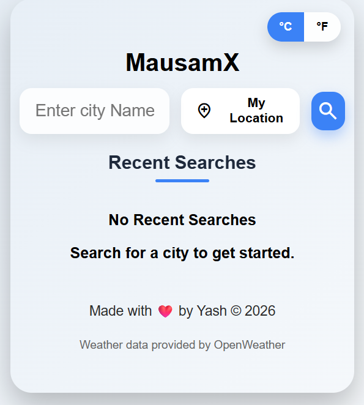
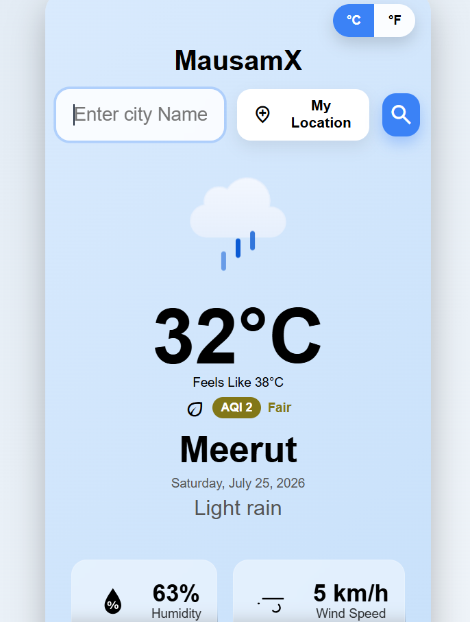
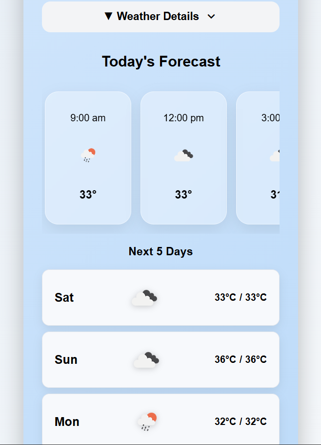
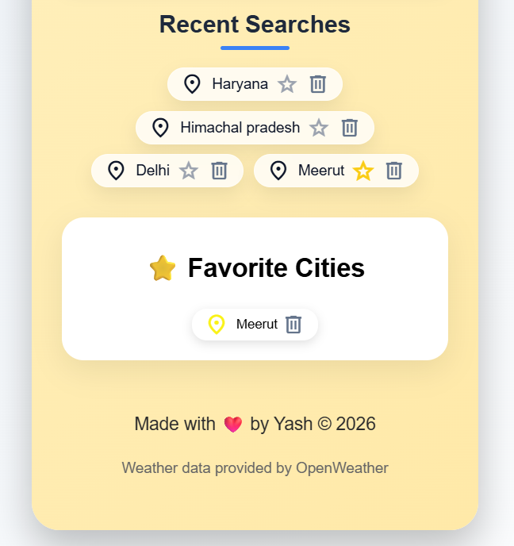
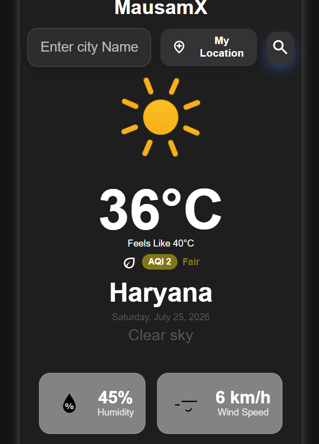

# 🌦️ MausamX - Advanced Weather Forecast Application

MausamX is a modern and responsive weather application that provides real-time weather information, Air Quality Index (AQI), hourly forecast, 5-day forecast, and location-based weather updates using the OpenWeatherMap API.

Built with **HTML, CSS, and JavaScript**, the application focuses on clean UI, responsive design, and a smooth user experience.

---

## 🚀 Live Demo

🔗 https://mausamx-weather.netlify.app/

---

## 📸 Screenshots

### 🏠 Home Page
> Search weather by city or use your current location.



---

### 🌤️ Weather Details
> Displays temperature, weather condition, AQI, humidity, wind speed, and more.



---

### 📅 Hourly & 5-Day Forecast



---

### ⭐ Favorites & Recent Searches



---

### 🌙 Dark Mode



---

## ✨ Features

- 🌍 Search weather by city name
- 📍 Current location weather (Geolocation)
- 🌡️ Celsius ↔ Fahrenheit toggle
- 🌤️ Real-time weather information
- 🌫️ Air Quality Index (AQI)
- 💧 Humidity
- 💨 Wind Speed
- 🤒 Feels Like Temperature
- 🕒 Hourly Weather Forecast
- 📅 5-Day Weather Forecast
- ⭐ Favorite Cities
- 📝 Recent Searches
- 💾 LocalStorage Support
- 🌙 Dark Mode
- 📱 Fully Responsive Design
- ⚡ Fast and Lightweight UI

---

## 🛠️ Built With

- HTML5
- CSS3
- JavaScript (ES6)
- OpenWeatherMap API
- Geolocation API
- LocalStorage API

---

## 📂 Project Structure

```
MausamX
│
├── index.html
├── style.css
├── script.js
├── Images
├── screenshots/
│
└── README.md
```

---

## 🔗 APIs Used

### Weather API

https://openweathermap.org/current

### 5-Day Forecast API

https://openweathermap.org/forecast5

### Air Pollution API

https://openweathermap.org/api/air-pollution

---

## 📱 Responsive Design

The application is optimized for:

- Desktop 💻
- Tablet 📱
- Mobile 📲

---

## 🎯 Future Improvements

- Weather Alerts
- PWA Support (Install as App)
- Multi-language Support
- Weather Maps
- Sunrise & Sunset Animations

---

## 👨‍💻 Author

**Yash**

GitHub:
https://github.com/Yash-bot-max
LinkedIn:
https://linkedin.com/in/yash-kumar-14nov2004

---

## ⭐ Support

If you liked this project, don't forget to give it a ⭐ on GitHub.
